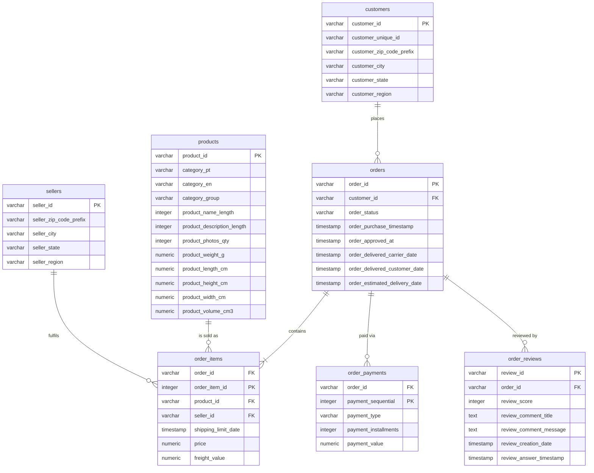

# Data Model

Seven tables in third normal form representing the relational structure of the Olist Brazilian E-Commerce dataset: `customers`, `sellers`, and `products` are dimensions; `orders` and `order_items` form the transaction spine; `order_payments` and `order_reviews` store payment methods and customer feedback.

## Entity relationship diagram

## Relationships

| Relationship | Cardinality | Enforced by |
|---|---|---|
| `customers` to `orders` | one to many | `fk_orders_customer` |
| `orders` to `order_items` | one to many | `fk_items_order` |
| `products` to `order_items` | one to many | `fk_items_product` |
| `sellers` to `order_items` | one to many | `fk_items_seller` |
| `orders` to `order_payments` | one to many | `fk_payments_order` |
| `orders` to `order_reviews` | one to many | `fk_reviews_order` |

## Key Design Decisions

1. **`customer_unique_id` vs `customer_id`**: Olist issues a new `customer_id` per order. Any customer-level grouping (RFM, repeat rate, cohort retention) must use `customer_unique_id` to avoid treating repeat orders from the same person as new customers.
2. **Product Category Translation**: Original Portuguese category names (`category_pt`) are mapped to English (`category_en`) and grouped into 9 macro-categories (`category_group`).
3. **Price vs Freight**: Product revenue (`price`) and delivery fee (`freight_value`) are stored separately on `order_items` to evaluate freight burden ratios across regions.
